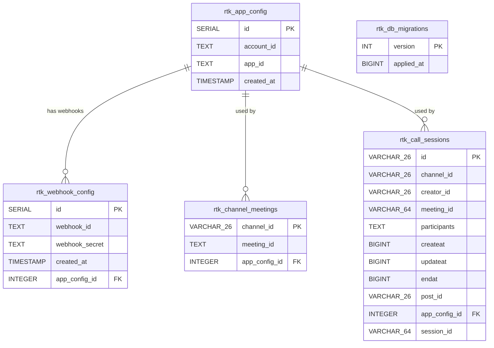

# ER Diagram

現在のデータベーススキーマ（PostgreSQL）の ER 図です。

## テーブル概要

| テーブル名 | 説明 |
|---|---|
| `rtk_app_config` | RTK アプリ設定（account_id / app_id）の履歴。最新行が有効。 |
| `rtk_webhook_config` | RTK Webhook 設定の履歴。`app_config_id` で紐付く `rtk_app_config` の行が有効時に登録されたものを識別できる。 |
| `rtk_channel_meetings` | チャンネルごとの RTK ミーティング ID マッピング。PK は `channel_id`（1チャンネル1ミーティング）。 |
| `rtk_call_sessions` | 通話セッション。`endat = 0` が進行中。`participants` は JSON 配列で格納。`session_id` は RTK セッション UUID（Webhook 受信前は空文字）。 |
| `rtk_db_migrations` | 適用済みマイグレーションのバージョン管理テーブル。 |

## インデックス

| インデックス名 | テーブル | カラム |
|---|---|---|
| `idx_rtk_call_channel` | `rtk_call_sessions` | `channel_id` |
| `idx_rtk_call_meeting` | `rtk_call_sessions` | `meeting_id` |

## リレーション備考

- `rtk_app_config` ← `rtk_webhook_config.app_config_id`：Webhook が登録された時点でアクティブだったアプリ設定を参照（nullable）
- `rtk_app_config` ← `rtk_channel_meetings.app_config_id`：チャンネルミーティング作成時にアクティブだったアプリ設定を参照（nullable）
- `rtk_app_config` ← `rtk_call_sessions.app_config_id`：コール作成時にアクティブだったアプリ設定を参照（nullable）
