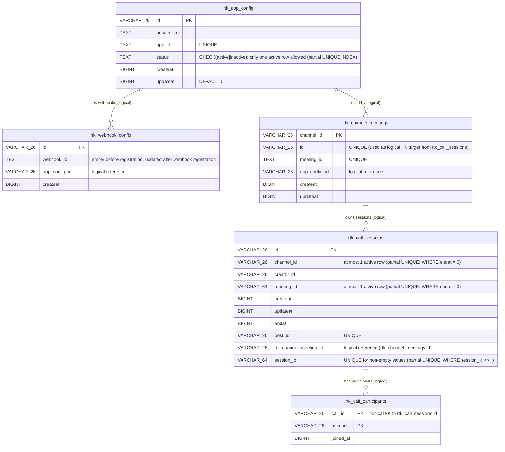

# ER Diagram

ER diagram of the current database schema (PostgreSQL). The entities conform to the migration DDL in `server/store/sqlstore/migrations/postgres/`.

> Note: The relationships above are logical references at the application layer; no `FOREIGN KEY` constraints are defined in the database.

## Table Overview

| Table | Description |
|---|---|
| `rtk_app_config` | RTK app configuration (`account_id` / `app_id`). `app_id` is `UNIQUE`. The row with `status='active'` is the current configuration; a partial UNIQUE INDEX ensures exactly one such row exists at any time. Switching `app_id` from x→y→x keeps the same `id` for x, transitioning only the `active`/`inactive` status, so historical logical references (e.g. `rtk_channel_meetings.app_config_id`) remain valid. |
| `rtk_webhook_config` | History of RTK webhook configurations. References `rtk_app_config` via `app_config_id`. A placeholder row is created with an empty `webhook_id` at registration time and updated with the actual value once webhook registration completes. |
| `rtk_channel_meetings` | Mapping of RTK meeting IDs per channel. PK is `channel_id` (one meeting per channel). The surrogate `id` column is used as a logical FK target from `rtk_call_sessions.rtk_channel_meeting_id`. |
| `rtk_call_sessions` | Call sessions. `endat = 0` means the session is active. `session_id` is the RTK session UUID (empty string before the first webhook arrives). `rtk_channel_meeting_id` is a logical FK to `rtk_channel_meetings.id`, reflecting the RTK concept that a Session belongs to a Meeting. The participant list is normalized into `rtk_call_participants`; this table holds no participant column. |
| `rtk_call_participants` | Participants per call session. Composite PK is `(call_id, user_id)`. `call_id` is a logical FK to `rtk_call_sessions.id`. Joins and leaves are represented as single-row INSERT/DELETE operations, preventing lost updates in HA environments (the previous design used a read-modify-write on a `rtk_call_sessions.participants` JSON column). `joined_at` is Unix milliseconds. |

## Migration Management

Schema changes are managed with [golang-migrate](https://github.com/golang-migrate/migrate). The version-tracking table is `rtk_db_migrations` (see `migrationsTable` in `server/store/sqlstore/migrate.go`). This table is an internal golang-migrate table and is not included in the ER diagram.

## Indexes

| Index Name | Table | Column(s) |
|---|---|---|
| `idx_rtk_call_channel` | `rtk_call_sessions` | `channel_id` |
| `idx_rtk_call_meeting` | `rtk_call_sessions` | `meeting_id` |
| `rtk_call_sessions_session_id_unique` | `rtk_call_sessions` | `session_id` (partial UNIQUE: `WHERE session_id <> ''`) |
| `rtk_call_sessions_active_channel_unique` | `rtk_call_sessions` | `channel_id` (partial UNIQUE: `WHERE endat = 0`) |
| `rtk_call_sessions_active_meeting_unique` | `rtk_call_sessions` | `meeting_id` (partial UNIQUE: `WHERE endat = 0`) |
| `idx_rtk_call_participants_call` | `rtk_call_participants` | `call_id` |
| `rtk_app_config_one_active` | `rtk_app_config` | `status` (partial UNIQUE: `WHERE status = 'active'`) |

## Relationship Notes

- `rtk_app_config` ← `rtk_webhook_config.app_config_id`: logical reference to the app configuration that was active when the webhook was registered (no DB constraint).
- `rtk_app_config` ← `rtk_channel_meetings.app_config_id`: logical reference to the app configuration that was active when the channel meeting was created (no DB constraint).
- `rtk_channel_meetings` ← `rtk_call_sessions.rtk_channel_meeting_id`: logical reference to the Meeting that owns the call (no DB constraint). The `id` column on `rtk_channel_meetings` is `UNIQUE` so it can be referenced without changing the `channel_id` PK.
- `rtk_call_sessions` ← `rtk_call_participants.call_id`: logical reference from participants to their call (no DB constraint). Participant operations are executed as single-row INSERT/DELETE via `Store.AddCallParticipant` / `RemoveCallParticipant`, with `SELECT ... FOR UPDATE` on the `rtk_call_sessions` row to prevent lost updates in HA environments and ghost participants on ended calls. When the last participant leaves, `endat` is set within the same transaction.
