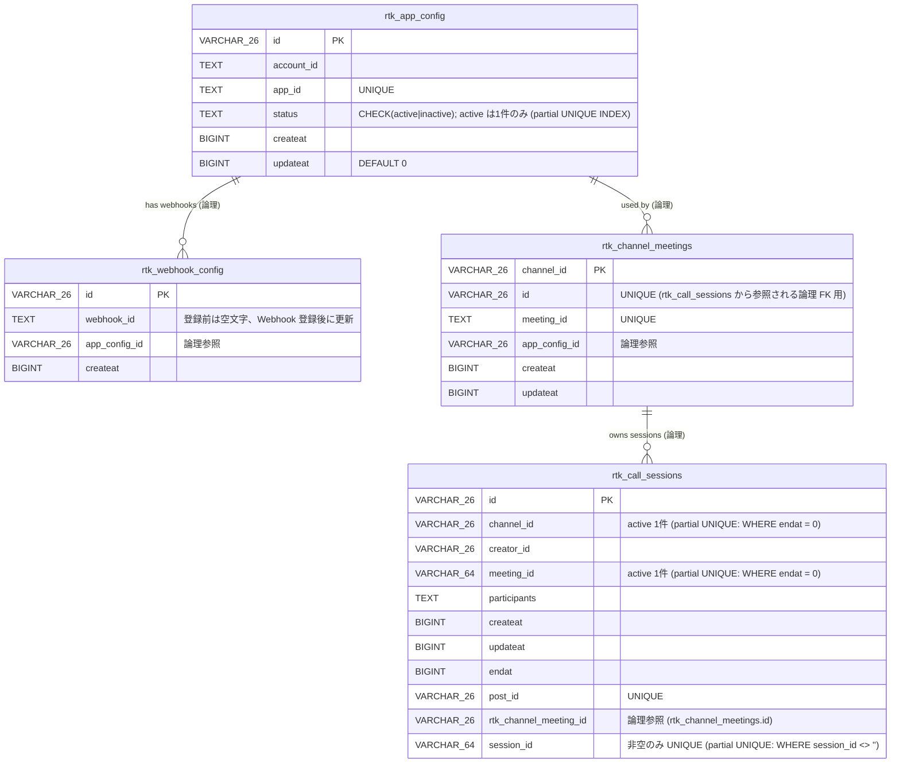

# ER Diagram

現在のデータベーススキーマ（PostgreSQL）の ER 図です。実体は `server/store/sqlstore/migrations/postgres/` のマイグレーション DDL に準拠します。

> 注: 上記リレーションはアプリケーション層での論理的な参照関係であり、DB 上に `FOREIGN KEY` 制約は定義されていません。

## テーブル概要

| テーブル名 | 説明 |
|---|---|
| `rtk_app_config` | RTK アプリ設定（`account_id` / `app_id`）。`app_id` は `UNIQUE`。`status='active'` の行が現行設定で、partial UNIQUE INDEX により常に1件のみ存在する。app_id を x→y→x と切り替えても、x の行は同じ id を保ったまま active/inactive を遷移するため、過去の論理参照（`rtk_channel_meetings.app_config_id` 等）はそのまま有効。 |
| `rtk_webhook_config` | RTK Webhook 設定の履歴。`app_config_id` で `rtk_app_config` を論理参照する。`webhook_id` は登録時に空文字でプレースホルダー行を作成し、Webhook 登録完了後に値で更新する運用。 |
| `rtk_channel_meetings` | チャンネルごとの RTK ミーティング ID マッピング。PK は `channel_id`（1 チャンネル 1 ミーティング）。サロゲート `id` は `rtk_call_sessions.rtk_channel_meeting_id` から論理参照される。 |
| `rtk_call_sessions` | 通話セッション。`endat = 0` が進行中。`participants` は JSON 配列で格納。`session_id` は RTK セッション UUID（Webhook 受信前は空文字）。`rtk_channel_meeting_id` は所属する `rtk_channel_meetings.id` への論理 FK で、「Session は Meeting に紐づく」という RTK の概念を表す。 |

## マイグレーション管理

スキーマ変更は [golang-migrate](https://github.com/golang-migrate/migrate) で管理しています。バージョン管理テーブル名は `rtk_db_migrations`（`server/store/sqlstore/migrate.go` の `migrationsTable` を参照）。本テーブルは golang-migrate が管理する内部テーブルのため、ER 図には含めていません。

## インデックス

| インデックス名 | テーブル | カラム |
|---|---|---|
| `idx_rtk_call_channel` | `rtk_call_sessions` | `channel_id` |
| `idx_rtk_call_meeting` | `rtk_call_sessions` | `meeting_id` |
| `rtk_call_sessions_session_id_unique` | `rtk_call_sessions` | `session_id` (partial UNIQUE: `WHERE session_id <> ''`) |
| `rtk_call_sessions_active_channel_unique` | `rtk_call_sessions` | `channel_id` (partial UNIQUE: `WHERE endat = 0`) |
| `rtk_call_sessions_active_meeting_unique` | `rtk_call_sessions` | `meeting_id` (partial UNIQUE: `WHERE endat = 0`) |
| `rtk_app_config_one_active` | `rtk_app_config` | `status` (partial UNIQUE: `WHERE status = 'active'`) |

## リレーション備考

- `rtk_app_config` ← `rtk_webhook_config.app_config_id`：Webhook が登録された時点でアクティブだったアプリ設定を論理参照（DB 制約は無し）
- `rtk_app_config` ← `rtk_channel_meetings.app_config_id`：チャンネルミーティング作成時にアクティブだったアプリ設定を論理参照（DB 制約は無し）
- `rtk_channel_meetings` ← `rtk_call_sessions.rtk_channel_meeting_id`：コールが所属する Meeting への論理参照（DB 制約は無し）。`rtk_channel_meetings.id` を `UNIQUE` カラムとして持つことで、PK の `channel_id` を変えずに参照できる。
