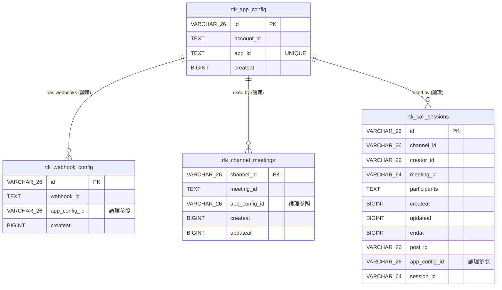

# ER Diagram

現在のデータベーススキーマ（PostgreSQL）の ER 図です。実体は `server/store/sqlstore/migrations/postgres/` のマイグレーション DDL に準拠します。

> 注: 上記リレーションはアプリケーション層での論理的な参照関係であり、DB 上に `FOREIGN KEY` 制約は定義されていません。

## テーブル概要

| テーブル名 | 説明 |
|---|---|
| `rtk_app_config` | RTK アプリ設定（`account_id` / `app_id`）の履歴。`app_id` は `UNIQUE`。最新行が有効。 |
| `rtk_webhook_config` | RTK Webhook 設定の履歴。`app_config_id` で `rtk_app_config` を論理参照する。 |
| `rtk_channel_meetings` | チャンネルごとの RTK ミーティング ID マッピング。PK は `channel_id`（1 チャンネル 1 ミーティング）。 |
| `rtk_call_sessions` | 通話セッション。`endat = 0` が進行中。`participants` は JSON 配列で格納。`session_id` は RTK セッション UUID（Webhook 受信前は空文字）。 |

## マイグレーション管理

スキーマ変更は [golang-migrate](https://github.com/golang-migrate/migrate) で管理しています。バージョン管理テーブル名は `rtk_db_migrations`（`server/store/sqlstore/migrate.go` の `migrationsTable` を参照）。本テーブルは golang-migrate が管理する内部テーブルのため、ER 図には含めていません。

## インデックス

| インデックス名 | テーブル | カラム |
|---|---|---|
| `idx_rtk_call_channel` | `rtk_call_sessions` | `channel_id` |
| `idx_rtk_call_meeting` | `rtk_call_sessions` | `meeting_id` |

## リレーション備考

- `rtk_app_config` ← `rtk_webhook_config.app_config_id`：Webhook が登録された時点でアクティブだったアプリ設定を論理参照（DB 制約は無し）
- `rtk_app_config` ← `rtk_channel_meetings.app_config_id`：チャンネルミーティング作成時にアクティブだったアプリ設定を論理参照（DB 制約は無し）
- `rtk_app_config` ← `rtk_call_sessions.app_config_id`：コール作成時にアクティブだったアプリ設定を論理参照（DB 制約は無し）
