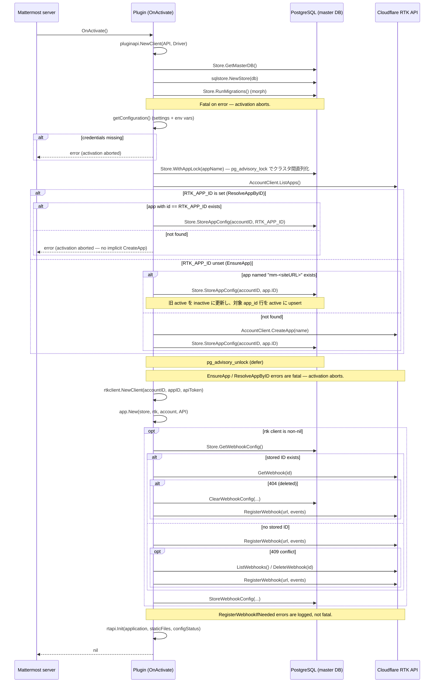

# Plugin Activation (Startup)

This document describes what happens when the RTK plugin is activated by the Mattermost server, i.e. the body of the `OnActivate` hook in `server/plugin.go`. It covers the order of operations, the side effects performed against the database and the Cloudflare RTK API, and how failures are handled.

The scope is intentionally limited to the **server-side activation sequence**. Configuration changes (`OnConfigurationChange`), deactivation (`OnDeactivate`), and webapp-side initialization are out of scope.

---

## Overview

`OnActivate` is invoked by the Mattermost plugin framework whenever the plugin is enabled or reloaded. If it returns a non-nil error, the plugin is deactivated and the error is surfaced in the server log.

The activation pipeline performs the following, in order:

1. Wrap the plugin API in a typed client (`pluginapi.Client`).
2. Open the master database handle and run schema migrations.
3. Read the active plugin configuration (settings + environment variables).
4. Provision (or resolve) the single Cloudflare RTK app for this Mattermost instance — `EnsureApp` (default) or `ResolveAppByID` (when `RTK_APP_ID` is set).
5. Build the app-scoped RTK client and the business-logic layer (`app.App`).
6. Register (or verify) the RTK webhook that delivers meeting events back to this plugin.
7. Initialize the HTTP API handler with the embedded static assets.

Phases 1, 2, 3 (credentials check) and 4 are **fatal**: any failure aborts activation. Phase 6 is **best-effort**: failures are logged and activation continues so that the operator can fix networking later via `OnConfigurationChange`.

---

## Startup Sequence



---

## Phase details

### Phase 1 — Mattermost API client

```go
p.client = pluginapi.NewClient(p.API, p.Driver)
```

A typed wrapper around the raw plugin API and Driver. Used immediately afterward to obtain the master database handle.

### Phase 2 — Store initialization & migrations

Files: `server/store/sqlstore/store.go`, `server/store/sqlstore/migrate.go`.

1. `p.client.Store.GetMasterDB()` — returns a `*sql.DB` against the Mattermost master database (PostgreSQL).
2. `sqlstore.NewStore(db)` — wraps the handle in the plugin's typed store.
3. `store.RunMigrations()` — applies embedded schema migrations using [`morph`](https://github.com/mattermost/morph):
   - Drops the legacy hand-rolled tracking table `rtk_schema_migrations` (`dropLegacyMigrationsTable`).
   - All migrations under `server/store/sqlstore/migrations/postgres/` are idempotent (`IF NOT EXISTS`) and tracked in `rtk_db_migrations`.

Any error at this phase is wrapped and returned, aborting activation.

### Phase 3 — Configuration loading

Files: `server/configuration.go`.

`p.getConfiguration()` returns the configuration cached by `OnConfigurationChange`. The plugin reads two settings:

- `CloudflareAccountID`
- `CloudflareAPIToken`

Each has an environment-variable override that takes **strict precedence** over the stored setting. The Cloudflare RealtimeKit App ID is **environment-only** (no settings field): when `RTK_APP_ID` is set, the plugin verifies the app exists in the configured Cloudflare account and uses it as the active app; when unset, the plugin falls back to discover-or-create via `EnsureApp` (Phase 4).

| Setting / Source       | Environment variable | Resolver                                |
|------------------------|----------------------|-----------------------------------------|
| `CloudflareAccountID`  | `RTK_ACCOUNT_ID`     | `configuration.GetEffectiveAccountID()` |
| `CloudflareAPIToken`   | `RTK_API_TOKEN`      | `configuration.GetEffectiveAPIToken()`  |
| (env-only, no setting) | `RTK_APP_ID`         | `configuration.GetEffectiveAppID()`     |

If either resolved credential (`AccountID` or `APIToken`) is empty, activation is aborted with an error directing the operator to set them in System Console or via the env vars above. Once credentials are present, the RTK provisioning phase below runs.

### Phase 4 — RTK app provisioning (`EnsureApp` / `ResolveAppByID`)

Files: `server/app/app.go`.

Both code paths produce the same `(appID, appConfigID)` outputs and are serialized cluster-wide via the same advisory lock. The branch is selected purely by whether the `RTK_APP_ID` environment variable is set.

#### 4a. `RTK_APP_ID` is set — `ResolveAppByID`

When `cfg.GetEffectiveAppID() != ""`, the plugin **never** auto-creates an app. Instead it:

1. Creates an account-level client: `rtkclient.NewAccountClient(accountID, apiToken)`.
2. Constructs a temporary `App` and calls `ResolveAppByID(accountID, envAppID)`.
3. Inside the advisory lock, calls `AccountClient.ListApps()` and searches for an entry with `app.ID == envAppID`.
   - **Found** → persists the mapping via `Store.StoreAppConfig(accountID, envAppID)` (the same idempotent transaction used by `EnsureApp`) and returns `(envAppID, appConfigID)`.
   - **Not found** → returns a wrapped error `ResolveAppByID: app ID %q not found in Cloudflare account %q`. **Activation is aborted.**

This guarantees that an env-supplied app ID maps to a real Cloudflare app under the configured account, with no implicit `CreateApp` side effects.

#### 4b. `RTK_APP_ID` is unset — `EnsureApp`

When the env var is not set, the plugin falls back to the original discover-or-create flow:

1. An account-level client is created: `rtkclient.NewAccountClient(accountID, apiToken)`.
2. A temporary `App` is constructed solely to call `EnsureApp(accountID)`.
3. `EnsureApp` derives a deterministic app name via `rtkAppName()`:
   - Strips the scheme and trailing slash from `ServiceSettings.SiteURL`.
   - Returns `"mm-" + siteURL` (e.g. `mm-mattermost.example.com`).
4. It calls `AccountClient.ListApps()` (Cloudflare RTK has no `GET /apps/{id}` endpoint, so a list-and-match is required) and looks for an app with that name:
   - **Found**: persist the mapping via `Store.StoreAppConfig(accountID, app.ID)`. Internally this is transactional and idempotent — the row for `app.ID` is upserted to `status='active'` and any other previously-active row is flipped to `status='inactive'`. Re-running with the same `app.ID` is a no-op.
   - **Not found**: call `AccountClient.CreateApp(name)` and persist the new mapping the same way.
5. The returned `(appID, appConfigID)` are used in the next phases.

#### Concurrency & failure handling (both branches)

The whole sequence (`ListApps → CreateApp/verify → StoreAppConfig`) is wrapped in `Store.WithAppLock(ctx, appName, fn)`, which acquires a PostgreSQL advisory lock keyed on the deterministic app name (the same key is used regardless of branch). This serializes the operation across cluster nodes so two Mattermost servers cannot race on `CreateApp` and create duplicate Cloudflare apps, nor double-write `rtk_app_config` for an env-supplied ID. The advisory lock is connection-scoped: a dedicated `db.Conn` is checked out for the lock and released (along with the lock) when `WithAppLock` returns.

Even if the advisory lock is bypassed (e.g. lock acquisition error), the partial UNIQUE INDEX on `rtk_app_config(status='active')` provides a second line of defense: a concurrent `StoreAppConfig` for a different `app_id` will fail with SQLSTATE `23505`, and the implementation retries by re-reading the active row.

Errors from either branch (network failure, invalid token, env App ID not found, etc.) are **fatal** — `OnActivate` returns a wrapped error and the plugin is deactivated by Mattermost.

### Phase 5 — App-scoped RTK client & business layer

Files: `server/rtkclient/client.go`, `server/app/app.go`.

Phase 4 guarantees a non-empty `appID` (otherwise activation would have aborted). The app-scoped client is then constructed unconditionally:

```go
rtkClient = rtkclient.NewClient(accountID, appID, apiToken)
```

The business-logic layer is then created with all dependencies:

```go
p.application = app.New(store, rtkClient, accountClient, p.API)
```

`app.IsConfigured()` returns `rtk != nil` and is later surfaced to the API layer via `configStatus`.

### Phase 6 — Webhook registration (`RegisterWebhookIfNeeded`)

Files: `server/app/webhook_manager.go`.

Only runs if `rtkClient != nil`. The callback URL is built from the Mattermost site URL:

```
{SiteURL}/plugins/{manifest.Id}/api/v1/webhook/rtk
```

(see `Plugin.webhookURL`).

The plugin subscribes to these RTK events (`rtkWebhookEvents`):

- `meeting.participantJoined`
- `meeting.participantLeft`
- `meeting.ended`

Flow:

1. Look up the stored webhook ID via `Store.GetWebhookConfig()`.
2. **If an ID is stored**: call `rtk.GetWebhook(id)` to verify it still exists.
   - Success → nothing to do.
   - `ErrWebhookNotFound` (404) → clear the stale ID and fall through to re-registration.
   - Any other error → log and return; do not re-register.
3. **Register** via `rtk.RegisterWebhook(url, events)`.
   - On `ErrWebhookConflict` (409 — same URL already registered upstream): list all webhooks, delete the entry whose `URL` matches, and retry registration.
4. Persist the new ID via `Store.StoreWebhookConfig(appConfigID, id)`.

All errors are logged via `LogWarn`/`LogInfo`; none of them abort activation.

### Phase 7 — HTTP API handler

Files: `server/api/`, `server/embed.go`.

```go
p.apiHandler = rtapi.Init(p.application, rtapi.StaticFiles{
    CallHTML: callHTML,
    CallJS:   callJS,
    WorkerJS: workerJS,
}, p.configStatus)
```

The static call-page assets (`assets/call.html`, `assets/call.js`, `assets/worker.js`) are embedded at compile time via `//go:embed` directives in `server/embed.go`. The `configStatus` callback lets the API layer report current readiness without holding a reference to the configuration struct.

After this step, `OnActivate` returns `nil` and the plugin is live. Incoming HTTP requests are dispatched by `Plugin.ServeHTTP` to `apiHandler`.

---

## Activation result and `configStatus`

The `Plugin.configStatus()` helper exposes the post-activation state to the API layer:

| Field             | Meaning                                                                     |
|-------------------|-----------------------------------------------------------------------------|
| `Enabled`         | `true` only if credentials are present **and** `app.IsConfigured()` is true (i.e. Phases 4-5 succeeded). |
| `AccountIDViaEnv` | `RTK_ACCOUNT_ID` is set; the stored setting is therefore overridden.        |
| `APITokenViaEnv`  | `RTK_API_TOKEN` is set; the stored setting is therefore overridden.         |
| `AppIDViaEnv`     | `RTK_APP_ID` is set; Phase 4 used `ResolveAppByID` (no implicit CreateApp). |
| `AccountID`       | The raw `CloudflareAccountID` setting value (not the env-resolved value).   |

When `Enabled == false` the API layer can still serve UI/status endpoints but RTK-dependent operations are unavailable.

---

## Failure semantics

| Phase | Failure mode | Behavior |
|-------|--------------|----------|
| 2. Master DB acquisition | error from `GetMasterDB` | **Fatal** — `OnActivate` returns wrapped error; plugin is deactivated. |
| 2. Store creation        | error from `sqlstore.NewStore` | **Fatal**. |
| 2. Migrations            | error from `RunMigrations` | **Fatal**. |
| 3. Config load           | resolved AccountID or APIToken empty | **Fatal** — operator must set them in System Console or via `RTK_ACCOUNT_ID`/`RTK_API_TOKEN`. |
| 4. EnsureApp             | network/auth error, list-or-create failure | **Fatal**. |
| 4. ResolveAppByID        | `RTK_APP_ID` not found in account, network/auth error | **Fatal** — no implicit `CreateApp`. |
| 5. RTK client construction | none expected (Phase 4 guarantees non-empty `appID`) | n/a |
| 6. Webhook verify/register | any RTK API error, missing SiteURL | **Best-effort** — logged; activation continues. |
| 7. API handler init        | none expected | n/a |

Recovery path: when the operator saves configuration in the System Console (or restarts the plugin after fixing networking), `OnConfigurationChange` re-runs the RTK provisioning steps that were skipped or failed during activation.

---

## Source map

| File                                              | Responsibility in startup                                |
|---------------------------------------------------|----------------------------------------------------------|
| `server/plugin.go`                                | `OnActivate` orchestration, `webhookURL`, `configStatus` |
| `server/configuration.go`                         | Configuration struct, env-var precedence, `getConfiguration` |
| `server/embed.go`                                 | Embeds static call-page assets                           |
| `server/store/sqlstore/store.go`                  | `NewStore`                                                |
| `server/store/sqlstore/migrate.go`                | `RunMigrations`, legacy table cleanup                    |
| `server/store/sqlstore/migrations/postgres/*.sql` | Embedded schema migrations                               |
| `server/rtkclient/account_client.go`              | `ListApps`, `CreateApp` (account-level RTK API)          |
| `server/rtkclient/client.go`                      | `GetWebhook`, `RegisterWebhook`, `ListWebhooks`, `DeleteWebhook` (app-scoped RTK API) |
| `server/app/app.go`                               | `EnsureApp`, `ResolveAppByID`, `rtkAppName`, `IsConfigured` |
| `server/app/webhook_manager.go`                   | `RegisterWebhookIfNeeded`, conflict resolution           |
| `server/api/`                                     | `rtapi.Init` HTTP handler wiring                         |
