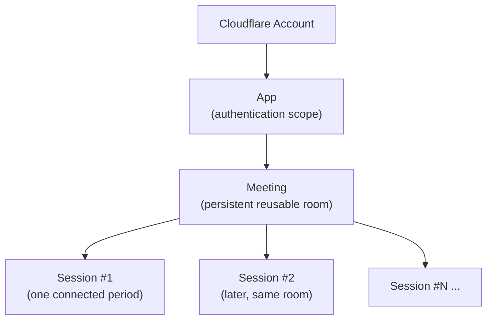
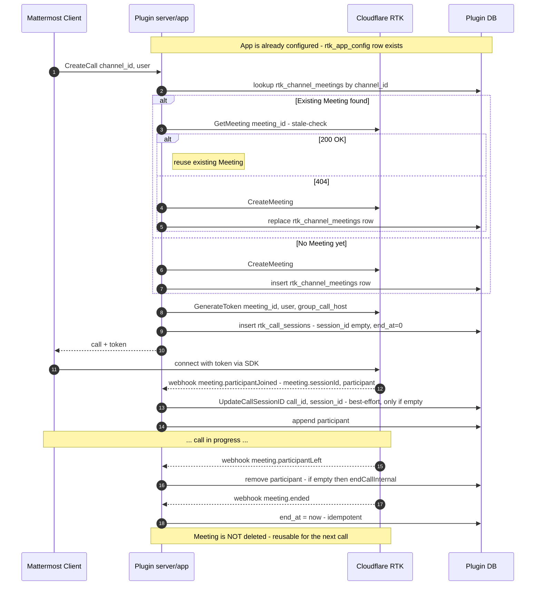

# RTK Concepts: App, Meeting, Session

This document explains the three core concepts of Cloudflare RealtimeKit (RTK) — **App**, **Meeting**, and **Session** — and how `mattermost-plugin-rtk` manages each of them.

It is intended as a conceptual reference. For lower-level details, see:

- [`ARCHITECTURE.md`](../ARCHITECTURE.md) — overall plugin architecture and call lifecycle
- [`docs/rtk-api-usage.md`](./rtk-api-usage.md) — exhaustive inventory of every RTK API call
- [`docs/er-diagram.md`](./er-diagram.md) — database schema

---

## 1. Overview

RTK organises real-time communication into a strict hierarchy:



| RTK concept | Lifetime | Identifier | What this plugin tracks |
|-------------|----------|------------|--------------------------|
| **App** | Long-lived (admin-managed) | `app_id` | One active App configuration row in `rtk_app_config` |
| **Meeting** | Permanent until explicitly deleted | `meeting_id` | One Meeting per Mattermost channel in `rtk_channel_meetings` (reused across calls) |
| **Session** | From first participant joining until everyone has left / `meeting.ended` | `session_id` (UUID) | One row in `rtk_call_sessions`; corresponds to a single "call" in the Mattermost UI |

The key insight is that a **Meeting is a permanent room** while a **Session is a single occupancy of that room**. The same Meeting hosts many Sessions over its lifetime, and each Mattermost-side "call" maps to exactly one Session.

---

## 2. App

### What it is in RTK

An **App** is the authentication and isolation boundary inside a Cloudflare account. Every Meeting belongs to exactly one App, and every server-side API call is scoped to a specific App via its base URL:

```
https://api.cloudflare.com/client/v4/accounts/{accountID}/realtime/kit/{appID}
```

API tokens grant access at the account level; the App ID selects which app the token operates on for app-scoped endpoints.

### How this plugin manages it

| Aspect | Implementation |
|--------|----------------|
| Storage | `rtk_app_config` table. Each row holds `account_id` + `app_id`; the latest row is treated as active. |
| Account-scoped client | [`server/rtkclient/account_client.go`](../server/rtkclient/account_client.go) — `AccountClient` with `CreateApp` / `ListApps`. Used before an App ID is known (admin setup). |
| App-scoped client | [`server/rtkclient/client.go`](../server/rtkclient/client.go) — `RTKClient` is constructed with the active App ID and used for all Meeting / Webhook operations. |
| Historical reference | Every `rtk_call_sessions`, `rtk_channel_meetings`, and `rtk_webhook_config` row stores the `app_config_id` that was active when it was created (logical FK; no DB constraint). This preserves the link to the specific App config used, even if the active App is later changed. |
| Setup flow | An admin selects an existing App or creates a new one through the configuration UI. The chosen App ID is persisted as a new `rtk_app_config` row. |

> Changing the active App does not migrate existing Meetings or Sessions; they remain associated with the App in which they were created via `app_config_id`.

---

## 3. Meeting

### What it is in RTK

A **Meeting** is a persistent, reusable room owned by an App. It is created once via `POST /meetings` and then exists until explicitly deleted. A Meeting can be joined many times over its lifetime; each occupied period is a separate Session.

The plugin uses these RTK endpoints against Meetings (full request/response details: [`docs/rtk-api-usage.md`](./rtk-api-usage.md)):

- `CreateMeeting` — `POST /meetings`
- `GenerateToken` — `POST /meetings/{meetingID}/participants` (per-participant JWT)
- `GetMeeting` — `GET /meetings/{meetingID}` (existence probe; 404 ⇒ deleted)

### How this plugin manages it

| Aspect | Implementation |
|--------|----------------|
| Storage | `rtk_channel_meetings` table — `channel_id` is the primary key, so **one channel always has at most one Meeting**. |
| Reuse policy | When a new call is started in a channel, the plugin first looks up the existing Meeting for that channel. If `GetMeeting` confirms it still exists on RTK, it is reused; otherwise a fresh `CreateMeeting` is issued and the row is replaced. This is the "stale-check" pattern — see `BR-27` in `server/app/calls.go`. |
| Token issuance | Tokens are minted per join (`GenerateToken`) with one of two presets: `group_call_host` for the call creator, `group_call_participant` for everyone else (constants `RTKPresetHost` / `RTKPresetParticipant` in `server/app/calls.go`). |
| Lifecycle | **`EndMeeting` is intentionally never called.** Ending a call (all participants leaving or the host invoking `EndCall`) ends only the current Session — the Meeting itself remains so the next call in the same channel can reuse it. |
| Logical link to App | Each `rtk_channel_meetings` row stores `app_config_id`, recording which App owns the Meeting. |

> Because Meetings are permanent, deletion only happens out-of-band (e.g. via Cloudflare dashboard or maintenance scripts). The plugin recovers transparently on the next `CreateCall` when `GetMeeting` returns 404.

---

## 4. Session

### What it is in RTK

A **Session** represents one occupied period of a Meeting — from the first participant joining until the last participant has left or `meeting.ended` fires. Each Session is identified by a UUID (`session_id`) that RTK delivers in webhook payloads. A single Meeting accumulates many Sessions over time, but only one Session is active at any moment.

Sessions are observed (not created) by the server: they materialise the moment the first participant connects. The plugin learns about them through webhooks:

- `meeting.participantJoined` (carries `meeting.sessionId`)
- `meeting.participantLeft`
- `meeting.ended`

See [`server/api/webhook.go`](../server/api/webhook.go) for the wire format and [`docs/asyncapi.yaml`](./asyncapi.yaml) for the inbound webhook contract.

### How this plugin manages it

A Session in RTK corresponds 1:1 to a **call** in the Mattermost UI. The plugin's representation lives in `rtk_call_sessions` and the `store.CallSession` Go struct.

| Field | Meaning |
|-------|---------|
| `id` | Plugin-generated UUID for the call (primary key). Independent of `session_id`. |
| `channel_id` | Mattermost channel hosting the call. |
| `creator_id` | User who issued `CreateCall` (becomes RTK host). |
| `meeting_id` | RTK Meeting reused for this Session. |
| `session_id` | RTK Session UUID. **Empty string until the first `participantJoined` webhook arrives**, then back-filled best-effort by `HandleWebhookParticipantJoined`. |
| `participants` | JSON array of currently-joined Mattermost user IDs. |
| `post_id` | The `custom_cf_call` post used as the channel-side UI for this call. |
| `app_config_id` | App config active at call creation time (logical FK to `rtk_app_config`). |
| `create_at` / `update_at` | Lifecycle timestamps (Unix ms). |
| `end_at` | `0` while the Session is active; set to a timestamp once ended. **`end_at = 0` is the canonical "active call" predicate** used throughout the codebase. |

> **`session_id == ""` does not mean the Session does not exist** — it only means the plugin has not yet observed a `participantJoined` webhook. Conversely, a stored `session_id` does not mean the Session is currently occupied; only `end_at == 0` does.

### Concurrency

All Session state mutations (`CreateCall`, `JoinCall`, `LeaveCall`, `EndCall`, webhook-driven `endCallInternal`) run under a single `callMu sync.Mutex` and re-read the row from the store inside the lock to prevent TOCTOU races between webhooks and user actions. See `server/app/calls.go` and the call-lifecycle section of [`ARCHITECTURE.md`](../ARCHITECTURE.md#33-call-business-logic).

---

## 5. End-to-end Lifecycle

The diagram below shows how App, Meeting, and Session interact during one full call.



Key invariants captured by this flow:

1. The **App** is selected once at configuration time and remains stable across the lifecycle.
2. The **Meeting** persists across calls; `CreateMeeting` is only invoked when no usable Meeting exists for the channel.
3. The **Session** materialises asynchronously: the plugin first writes a `CallSession` row with `session_id=""`, and back-fills `session_id` when the first `participantJoined` webhook arrives.
4. Termination only ends the Session (`end_at` set, `RemoveActiveCallID`); the Meeting is left alive for reuse.

---

## 6. Cross-reference Table

| Concept | RTK API surface | DB table | Primary Go code |
|---------|-----------------|----------|-----------------|
| **App** | `POST /apps`, `GET /apps` (account-scoped) | `rtk_app_config` | `server/rtkclient/account_client.go`, configuration plumbing in `server/configuration.go` |
| **Meeting** | `POST /meetings`, `GET /meetings/{id}`, `POST /meetings/{id}/participants` | `rtk_channel_meetings` | `server/rtkclient/client.go`, `server/app/calls.go` (CreateCall / JoinCall) |
| **Session** | Inbound webhooks: `meeting.participantJoined`, `meeting.participantLeft`, `meeting.ended` | `rtk_call_sessions` | `server/app/webhook.go`, `server/api/webhook.go`, `server/store/models.go` |
| **Webhook registration** (cross-cutting) | `POST /webhooks`, `GET /webhooks`, `DELETE /webhooks/{id}` | `rtk_webhook_config` | `server/rtkclient/client.go`, `server/app/webhook_manager.go` |

---

## 7. Related Documents

- [`ARCHITECTURE.md`](../ARCHITECTURE.md) — full architecture, including the call business-logic state machine and concurrency model
- [`docs/rtk-api-usage.md`](./rtk-api-usage.md) — every RTK request/response the plugin uses
- [`docs/er-diagram.md`](./er-diagram.md) — database schema and table-level relationships
- [`docs/asyncapi.yaml`](./asyncapi.yaml) / [`docs/openapi.yaml`](./openapi.yaml) — machine-readable API contracts
